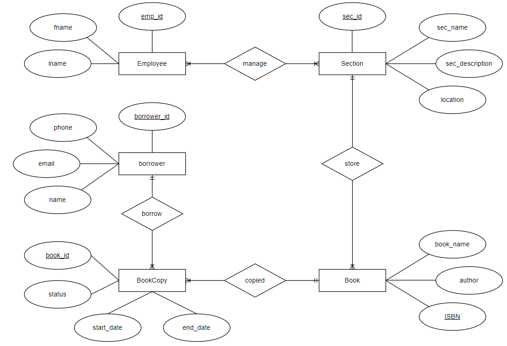

# Library Management System



A web-based library management system developed using the **Spring Framework** and **Oracle DBMS** to streamline library operations, enhance user experience, and manage resources effectively.

## Table of Contents
- [Introduction](#introduction)
- [Features](#features)
- [Technologies Used](#technologies-used)
- [Setup and Installation](#setup-and-installation)
- [Project Structure](#project-structure)

## Introduction
The project aims to modernize library operations by providing an intuitive, secure, and efficient platform for managing library resources. It includes a comprehensive database design, a user-friendly interface, and follows the Model-View-Controller (MVC) architecture.

## Features
- **Employee Management**:
  - Add, update, list, and delete employees.
- **Section Management**:
  - Manage sections with descriptions and locations.
- **Book Management**:
  - Add, update, list, and delete books, along with assigning them to sections.
- **Copy Management**:
  - Track book copies, their availability, and borrowing history.
- **Borrower Management**:
  - Manage borrower details and their borrowing activity.
- **Authentication**:
  - Secure login system for admin access.

## Technologies Used
- **Backend**: Java, Spring Framework (Spring Boot)
- **Database**: Oracle DBMS
- **Frontend**: Thymeleaf, Bootstrap
- **Security**: Spring Security (BCrypt)

## Setup and Installation
1. Clone the repository:
   ```bash
   git clone https://github.com/aminsafri/Library-Management-System.git
   cd Library-Management-System
   ```
2. Configure the database in `src/main/resources/application.properties`.
3. Build and run the application:
   ```bash
   ./mvnw spring-boot:run
   ```
4. Access the application at `http://localhost:8080`.

## Project Structure
- `src/main/java/com.project.library`:
  - `controller`: Contains REST controllers for managing entities.
  - `model`: Entity classes mapped to the database.
  - `repository`: Interfaces for database operations.
  - `SecurityConfig`: Configures Spring Security.
- `src/main/resources/templates`: Thymeleaf templates for the frontend.
- `src/main/resources/application.properties`: Configuration file for database and app settings.
